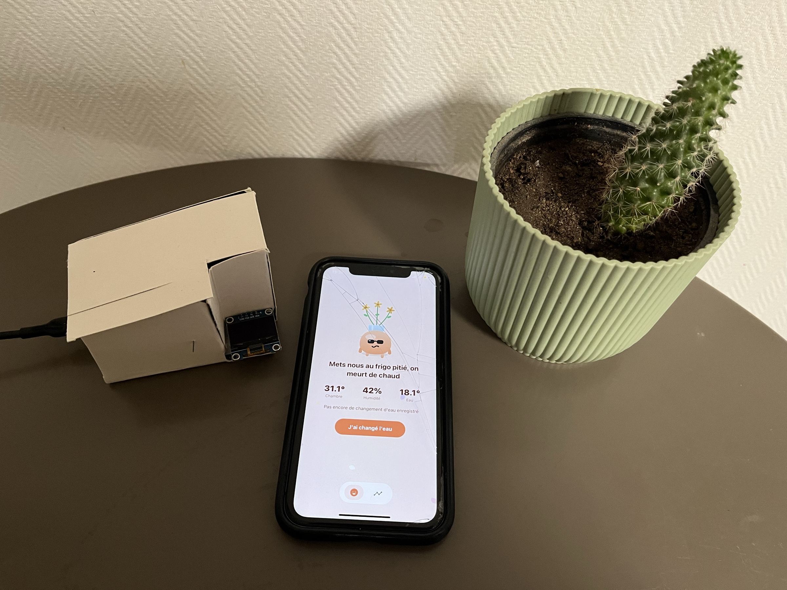
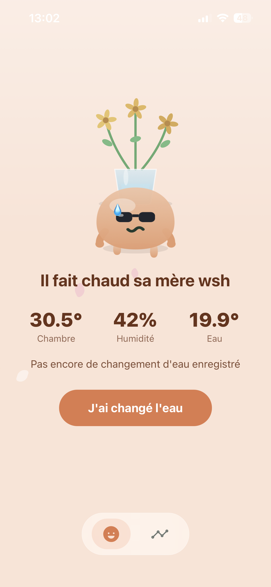
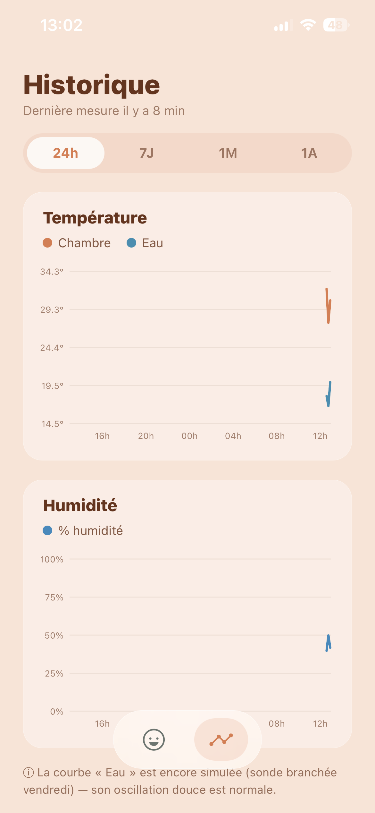
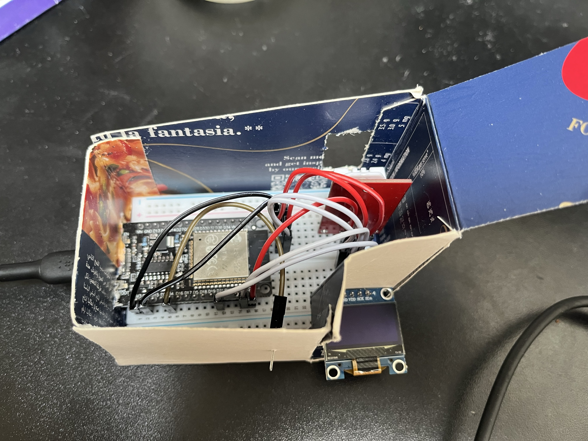
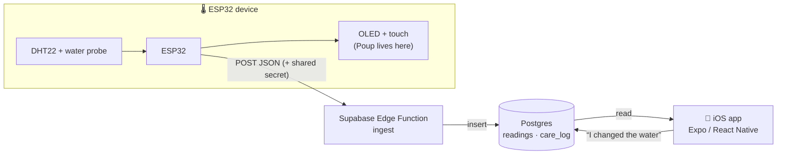

<div align="center">

# 🌱 Poup — the flower guardian

**A tiny connected companion that watches over a vase of flowers.**
An ESP32 reads the room and the water, a cute slime named *Poup* reacts on a little
OLED screen when you touch the case, and an iOS app lets you follow everything and
care for the flowers.

<!-- Add docs/media/hero.jpg (see docs/media/README.md) -->


</div>

---

## ✨ What it is

Poup started as a gift. Instead of a cold dashboard, the data is given a *face*: a
small green slime that expresses how the flowers feel. Happy when all is well, thirsty
when the water is old, shivering when the room is cold. The same logic drives the phone
app, the on-device OLED animation, and (soon) push notifications.

- **Hardware** — an ESP32 with a DHT22 (room temperature + humidity) and a water-temperature
  probe, plus a 128×64 OLED and a capacitive touch button.
- **Cloud** — Supabase (Postgres + Row Level Security + a Deno Edge Function).
- **App** — an Expo / React Native (TypeScript) iOS app, shipped via TestFlight.

## 📱 Demo

| Home (Poup + flowers) | History (charts) | Hardware |
|---|---|---|
|  |  |  |

<p align="center"></p>

## 🧩 Architecture

The app **never** talks to the ESP32 directly — everything flows through Supabase.



- The ESP32 only **POSTs** measurements (authenticated by a shared `DEVICE_SECRET`).
- The app only uses the **anon** key (public by design) — Row Level Security protects the data.
- Chart data is **aggregated server-side** (a Postgres function) so the graphs stay fast
  and accurate regardless of how much history piles up.

## 🧠 How Poup decides its mood

A single pure function (`lib/plantState.ts`) maps the latest reading + last water change
to one of Poup's moods. Thresholds live in one shared config (`config/poup.ts`) and are
mirrored in the firmware.

Priority (most to least urgent): **pressing need → night → ambient comfort → happy**

| Mood | Trigger |
|---|---|
| 💧 `change_eau` | water unchanged for > 3 days (> 2 if water is warm) — shown even at night |
| 🥵 `chaud` | room temperature > 27 °C |
| 🥶 `froid` | room temperature < 15 °C |
| 😴 `endormi` | local time is night (21:00–07:00) and nothing urgent |
| 😀 `content` | everything is fine |
| 🥀 `soif` | water ≈ air (vase likely empty) — enabled once the real water probe is wired |

## 🛠️ Tech stack

- **App** — Expo SDK 56, React Native, TypeScript, `expo-router`, `react-native-svg`
  (custom charts), `react-native-pager-view`, Jest (unit-tested state logic).
- **Backend** — Supabase: Postgres, RLS, Deno Edge Function, a SQL aggregation function.
- **Firmware** — ESP32 (Arduino), DHT22, SSD1306 OLED, capacitive touch.

## 📂 Repository

```
.
├── app/ · components/ · lib/ · config/   # the Expo iOS app
├── firmware/                              # ESP32 sketch (Arduino) + OLED preview
│   ├── poup_station/                      #   main sketch (+ secrets.example.h)
│   └── preview/                           #   open the .html to preview the OLED in a browser
├── supabase/                             # backend: schema, RLS, Edge Function, SQL function
└── docs/media/                           # screenshots & photos
```

## 🚀 Getting started

### App
```bash
npm install
cp .env.example .env      # fill in your Supabase URL + anon key
npx expo start
```

### Firmware
1. Arduino IDE → install **Adafruit SSD1306**, **Adafruit GFX**, **DHT sensor library**.
2. `cp firmware/poup_station/secrets.example.h firmware/poup_station/secrets.h` and fill it in.
3. Open `firmware/poup_station/poup_station.ino`, pick your ESP32 board + port, **Upload**.

> No hardware? Open `firmware/preview/poup_oled_preview.html` in a browser to preview the
> OLED animation and all of Poup's moods.

### Backend
See [`supabase/README.md`](supabase/README.md) — run `schema.sql`, deploy the `ingest`
function, set `DEVICE_SECRET`, run `readings_buckets.sql`.

## 🗺️ Roadmap

- [x] iOS app (live readings, history charts, "changed the water")
- [x] On-device OLED with touch-to-wake Poup animation
- [x] Server-side chart aggregation
- [ ] Push notifications on threshold crossings
- [ ] Real DS18B20 water probe (replaces the simulated value)
- [ ] Battery + deep sleep, physical enclosure
- [ ] On-device ML room-state estimation ("Pneuma")

## 📄 License

[MIT](LICENSE)
